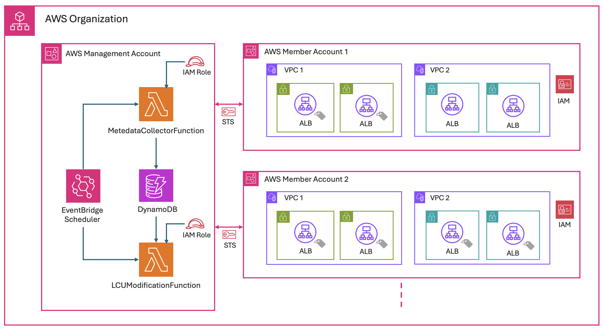

## Overview
---
This solution automates Load Balancer Capacity Unit (LCU) Reservation for Application Load Balancers (ALBs) using the ELBV2 API, enabling automated capacity provisioning and management across an AWS Organizations multi-account environment. Two CloudFormation templates deploy the solution in management and member accounts. Upon deployment, it creates two Lambda functions, a DynamoDB table, and IAM roles in the management account, along with IAM roles to allow Lambda function access to ALBs in member accounts.

## Solution Overview
---
The solution centralizes ALB capacity management across AWS Organization accounts using two Lambda functions in the management account. The first function discovers tagged ALBs across member accounts and stores their data in DynamoDB, while the second handles LCU reservations. The functions use STS AssumeRole for cross-account access and are triggered by EventBridge schedulers. ALBs require two tags: "ALB-LCU-R-SCHEDULE: Yes" and "LCU-SET: <value>" for capacity provisioning.

### The three-stage automated process operates as follows

**Pre-event:** EventBridge triggers Lambda to scan tagged ALBs across accounts, storing their metadata in DynamoDB.
**Event preparation:** Second Lambda sets ALB capacity based on stored information and LCU-SET tag values.
**Post-event:** Final EventBridge trigger resets LCU capacity for cost optimization.

This centralized approach efficiently manages hundreds of ALBs across accounts while minimizing operational overhead.

### Using CloudFormation Templates

> Management Account: ALBCapacityAutomationMgmtAccount.YAML
> Member Account(s): ALBCapacityAutomationMemberAccount.YAML

## Deployment
---
Once you download the templates, follow these steps to deploy the resources using the CloudFormation template:
To create your resources using the AWS CloudFormation template, complete the following steps:

1.  Sign in to the AWS Management Console
2.  Navigate to the AWS CloudFormation console > Create Stack > “With new resources”
3.  Upload the yaml template file and choose Next
4.  Specify a “Stack name”, review the parameters and choose Next
**Note:** When deploying the Management account template, you can change the schedule time and day for each one of the three events. See the cron syntax in the Event Bridge documentation.
5.  Leave the “Configure stack options” at default values and choose Next
6.  Review the details on the final screen and under “Capabilities” check the box for “I acknowledge that AWS CloudFormation might create IAM resources with custom names.
7.  Choose Submit

## Troubleshooting

For troubleshooting, use Lambda function Logs, read the article for more details - https://docs.aws.amazon.com/lambda/latest/dg/monitoring-cloudwatchlogs-view.html#monitoring-cloudwatchlogs-console

## License

This project (Automating AWS Application Load Balancer Capacity Reservation) is licensed under the Apache 2.0 License: https://www.apache.org/licenses/LICENSE-2.0