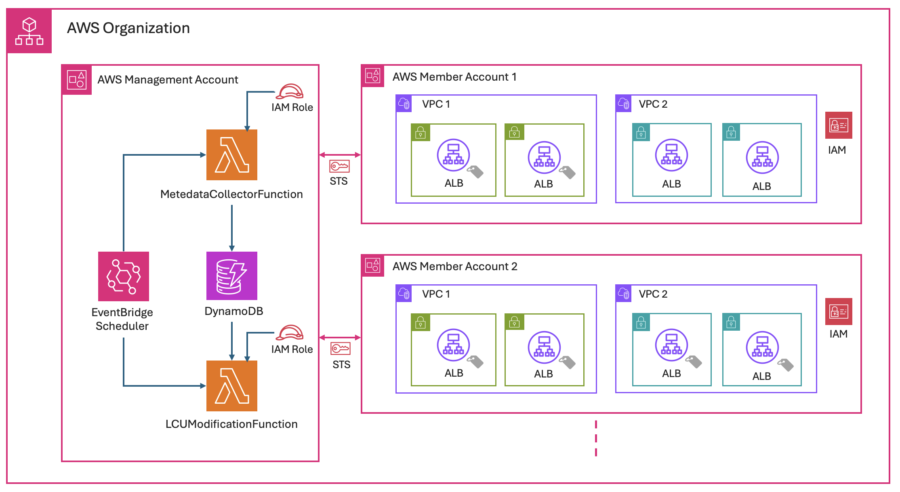

## Overview
---
This solution automates Load Balancer Capacity Unit (LCU) Reservation for Application Load Balancers (ALBs) using the ELBV2 API, enabling automated capacity provisioning and management across an AWS Organizations multi-account environment. Two CloudFormation templates deploy the solution in management and member accounts. Upon deployment, it creates two Lambda functions, a DynamoDB table, and IAM roles in the management account, along with IAM roles to allow Lambda function access to ALBs in member accounts.

## Solution Overview
---
The solution centralizes ALB capacity management across AWS Organization accounts using two Lambda functions in the management account. The first function discovers tagged ALBs across member accounts and stores their data in DynamoDB, while the second handles LCU reservations. The functions use STS AssumeRole for cross-account access and are triggered by EventBridge schedulers. ALBs require two tags: "ALB-LCU-R-SCHEDULE: Yes" and "LCU-SET: <value>" for capacity provisioning.

### The three-stage automated process operates as follows

**Pre-event:** EventBridge triggers Lambda to scan tagged ALBs across accounts, storing their metadata in DynamoDB.
**Event preparation:** Second Lambda sets ALB capacity based on stored information and LCU-SET tag values.
**Post-event:** Final EventBridge trigger resets LCU capacity for cost optimization.

This centralized approach efficiently manages hundreds of ALBs across accounts while minimizing operational overhead.

### Metadata consistency between the two Lambda functions

The two functions share the `alb-prewarm-metadata` DynamoDB table, so the metadata collector publishes its results as immutable generations rather than editing the table in place:

1. Each collector run tags every item it writes with a unique `Generation` value. Existing items are left untouched while the run is in progress.
2. When the run finishes, the collector writes a single control item (`id = __CURRENT_GENERATION__`) naming the generation that is now current. This one `PutItem` is the atomic commit point.
3. Only then does the collector delete items belonging to older generations, using conditional deletes so it cannot remove items that a newer run has already published.

The LCU modification function reads the control item first and processes only items matching the committed generation. A collector run that is still in progress is therefore invisible to it: it either reads the previous complete snapshot or the new one, never an empty or half-built table.

Further safeguards:

- If a collector run produces no ALB data **and** encountered errors, it does not commit. The previously published generation stays current and the run returns a `500` so the failure is visible in logs and metrics, rather than silently blanking the snapshot.
- The collector is configured with `ReservedConcurrentExecutions: 1`, so overlapping invocations cannot build two generations at once.
- The commit itself is conditional on the new generation being newer than the published one. Generation IDs start with a fixed-width UTC timestamp, so DynamoDB can order them with a lexical comparison. This covers cases that reserved concurrency does not, such as a scheduler retry finishing after the original invocation, or a manual re-invoke racing the scheduled run. A run that loses the race leaves the pointer alone, skips cleanup so it cannot delete the winning run's items, and reports `committed: false`.

Tables created before this behavior existed have no control item. In that case the modification function logs a warning and falls back to reading every item, so the first collector run after an upgrade is not blocked. Once that run commits, generation gating takes effect.

### Using CloudFormation Templates

> Management Account: ALBCapacityAutomationMgmtAccount.YAML
> Member Account(s): ALBCapacityAutomationMemberAccount.YAML

## Deployment
---
Once you download the templates, follow these steps to deploy the resources using the CloudFormation template:
To create your resources using the AWS CloudFormation template, complete the following steps:

1.  Sign in to the AWS Management Console
2.  Navigate to the AWS CloudFormation console > Create Stack > “With new resources”
3.  Upload the yaml template file and choose Next
4.  Specify a “Stack name”, review the parameters and choose Next
**Note:** When deploying the Management account template, you can change the schedule time and day for each one of the three events. See the cron syntax in the Event Bridge documentation.
5.  Leave the “Configure stack options” at default values and choose Next
6.  Review the details on the final screen and under “Capabilities” check the box for “I acknowledge that AWS CloudFormation might create IAM resources with custom names.
7.  Choose Submit

## Troubleshooting

For troubleshooting, use Lambda function Logs, read the article for more details - https://docs.aws.amazon.com/lambda/latest/dg/monitoring-cloudwatchlogs-view.html#monitoring-cloudwatchlogs-console

## License

This project (Automating AWS Application Load Balancer Capacity Reservation) is licensed under the Apache 2.0 License: https://www.apache.org/licenses/LICENSE-2.0