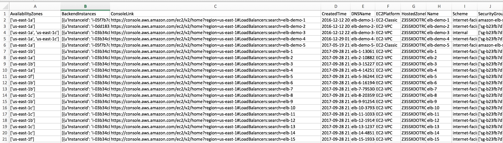
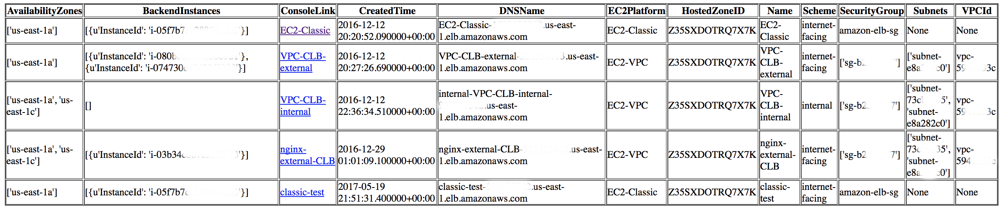

## Classic Load Balancer Console Link utility

### Overview:
This utility helps create a CSV spreadsheet or a HTML file of Classic Load Balancers' AWS Console URL link along with other attributes -- 'Name', 'DNSName', 'Scheme', 'HostedZoneID', 'CreatedTime', 'VPCId', 'AvailabilityZones', 'EC2Platform', 'Subnets' and 'SecurityGroup'.

It enable you to search and manage your Classic Load Balancers easily without dealing with pagination through API call or going over page by page through AWS console.

If you have a big number of Classic Load Balancers, this tool enables you to search and manage your Classic Load Balancers easily without dealing with pagination through API or going over page by page through AWS console.


### Usage:
```
consolelink_classic_load_balancer.py
--region <value>
--format <value>
[--debug <value>]
```

Example 1: Create a CSV spreadsheet of AWS Console URL link for Classic Load Balancers in us-west-2 region
```
consolelink_classic_load_balancer.py --region us-west-2 --format csv
```

Example 2: Create a HTML spreadsheet of AWS Console URL link for Classic Load Balancers in us-west-2 region
```
consolelink_classic_load_balancer.py --region us-west-2 --format html
```

### CSV File:



### HTML File:



### License
The Classic Load Balancer Console Link utility is licensed under the Apache 2.0 License: https://www.apache.org/licenses/LICENSE-2.0

