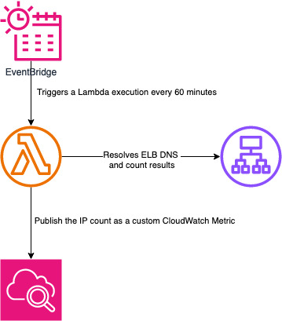
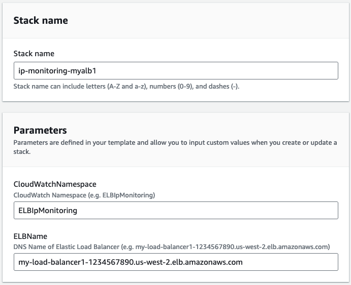
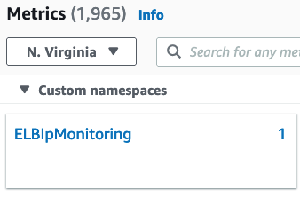
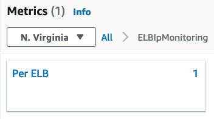
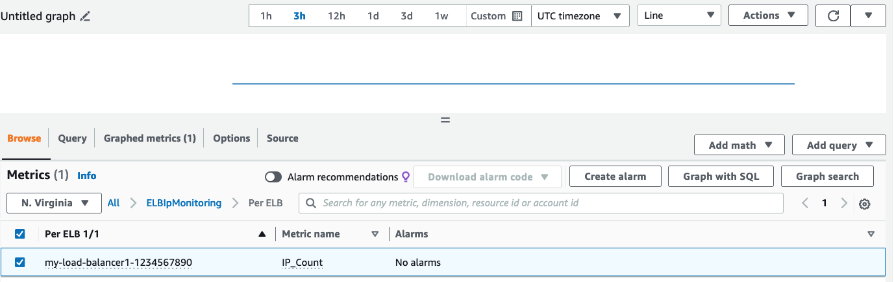

## Overview

This CloudFormation template deploys a solution to publishes a CloudWatch metric indicating the number of IP addresses being used by either an Application or Classic Load Balancer.

Benefits and use cases of this template include:
- **Subnet sizing** - Knowing how many IPs are used can help you with subnet sizing.
- **Sharding** - Both Classic and Application Load Balancers have an IP address limit of 100 for each load balancer. If consumption approaches this limit, it is advisable to distribute the traffic across multiple load balancers.

## Architecture

## Deployment

1. In the AWS Management Console, go to "CloudFormation" and click "Create stack"

1. Select "Upload a template file", choose elb_ip_monitoring.yml and click Next

1. Fill up the parameters:
     -  **Stack Name** - Any name to identify the stack
     -  **CloudWatchNamespace** - Metrics will be pubished inside this CloudWatch Namespace. It is suggested you keep the same namespace for all stacks so you will have a centralized place for all ELB IP monitoring metrics.
     - **ELBName** - DNS Name of a single ELB (Application or Classic)

1. Click Next and Next again for the stack creation. You will need to acknowledge the creation of an IAM role. The IAM role is used to execute the Lambda function that will resolve the ELB's DNS name and paste the count in a CloudWatch metric.

## Usage

Once the stack is created, you can navigate to CloudWatch console and click All metrics and select the Custom namespace with the name you provided when creating the stack:

Then select "Per ELB" Dimension:

Below the metric showing the number of IPs the load balancer have over a period of time. In the example below, the load balancer has 6 IPs.

