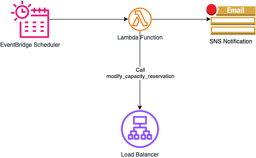

# Scheduler for Load balancer Capacity Unit Reservation

## Overview
CloudFormation template for scheduling capacity reservation using the Load balancer Capacity Unit Reservation feature for [Application Load Balancers(ALB)](https://docs.aws.amazon.com/elasticloadbalancing/latest/application/capacity-unit-reservation.html) and [Network Load Balancers(NLB)](https://docs.aws.amazon.com/elasticloadbalancing/latest/network/capacity-unit-reservation.html)

## Architecture

## Deployment

1. In the AWS Management Console, go to "CloudFormation" and click "Create stack"

1. Select "Upload a template file", choose capacity-reservation-scheduler.yml and click Next

1. Fill up the parameters:

    - LoadBalancerArn - The ARN of the ALB or NLB to reserve capacity
    - ProvisionedCapacityScheduleStart - Schedule to provision the capacity in [Cron format](https://docs.aws.amazon.com/eventbridge/latest/userguide/eb-scheduled-rule-pattern.html) Example: "0 13 * * ? *" for every day at 13:00.
    - ProvisionedCapacityScheduleStop - Schedule to reduce or reset the capacity in [Cron format](https://docs.aws.amazon.com/eventbridge/latest/userguide/eb-scheduled-rule-pattern.html) Example: "0 14 * * ? *" for every day at 14:00.
    - CapacityReservation - The minimum load balancer capacity to be reserved.
    - CapacityReset - The minimum load balancer capacity to return to. Set 0 to reset.
    - TimeZone - [OPTIONAL] Timezone for the schedule. Use [IANA convention](https://www.iana.org/time-zones). Example: Australia/Sydney or default to UTC.
    - ScheduleGroup - [OPTIONAL] If you have a Schedule Group, add in this field, otherwise leave it blank to create a new one.
    - NotificationEmail - [OPTIONAL] E-mail address to receive notification via SNS.
    - Tag - [OPTIONAL] Tag to associate with resources. Thee ELB name will be used if left blank.
    - StartDate - [OPTIONAL] The date, in UTC (yyyy-MM-ddTHH:mm:ss.SSSZ), before which the schedule will start (immediate if blank). Example: 2024-12-03T01:00:00.000Z
    - EndDate - [OPTIONAL] The date, in UTC (yyyy-MM-ddTHH:mm:ss.SSSZ), before which the schedule will end (ignored if blank) 2024-12-04T23:00:00.000Z

    ps: StartDate and EndDate define the time boundary for the whole schedule, whereas ProvisionedCapacityScheduleStart and ProvisionedCapacityScheduleStop define the schedule itself. For example, if StartDate is 2024-12-03T01:00:00.000Z and EndDate is 2024-12-10T01:00:00.000Z, and ProvisionedCapacityScheduleStart is "0 13 * * ? *", it means that starting on  2024-12-03 at 01, there will be a schedule that runs every day at 13:00 until 2024-12-10 at 01.

1. Click Next and Next again for the stack creation.

## Usage

Once the schedule stack is deployed, you can check the [ReservedLCUs](https://docs.aws.amazon.com/elasticloadbalancing/latest/application/load-balancer-cloudwatch-metrics.html) metric to see the capacity is reserved according to the schedule. If you input your e-mail, you should also receive notifications (you have to confirm subscription to the SNS topic).

## Troubleshooting

For troubleshooting, use [Lambda Logs](https://docs.aws.amazon.com/lambda/latest/dg/monitoring-cloudwatchlogs-view.html).

## License
The Scheduler for Load balancer Capacity Unit Reservation is licensed under the Apache 2.0 License: https://www.apache.org/licenses/LICENSE-2.0

## Contributions

Contributions are welcome. Please check the guidelines on CONTRIBUTING.md