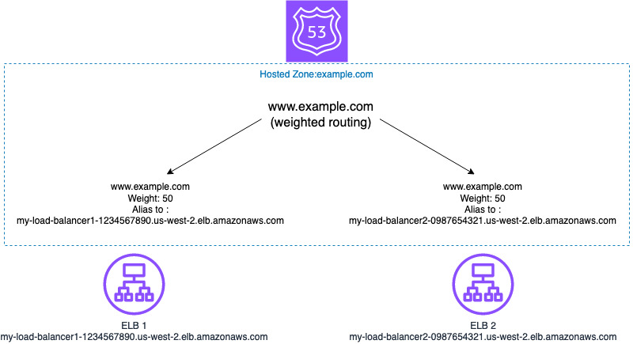
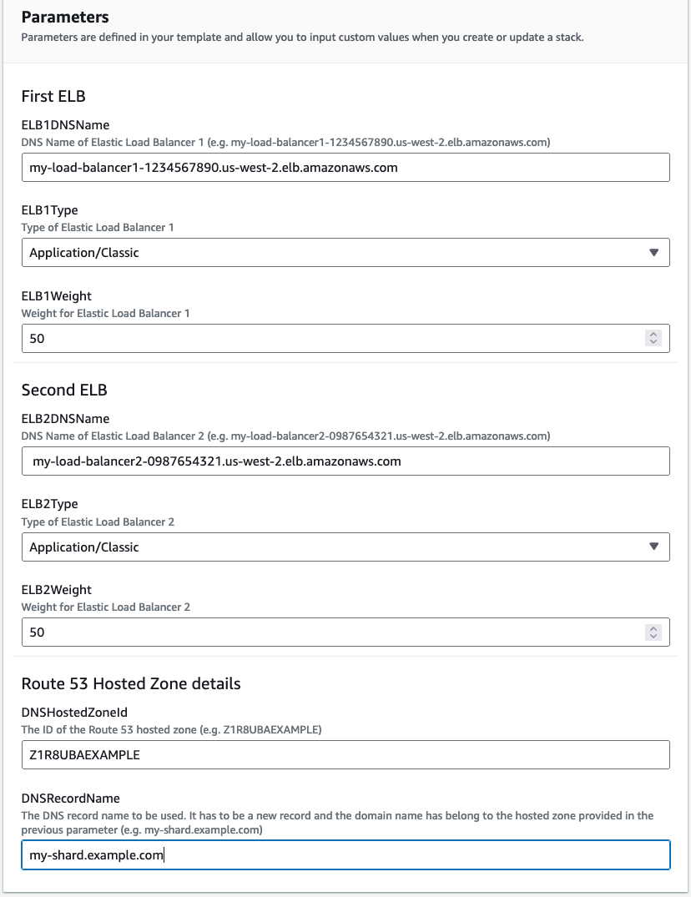
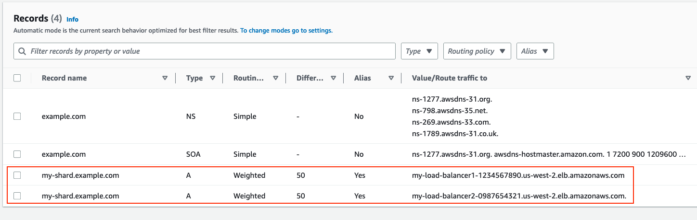

## Overview

CloudFormation template that creates two Route 53 records using weighted routing to split the load accross two load balancers.

* This template does not create the load balancers, only the Route 53 records

## Architecture




## Deployment

1. In the AWS Management Console, go to "CloudFormation" and click "Create stack"

1. Select "Upload a template file", choose elb_ip_monitoring.yml and click Next

1. Fill up the parameters:
     -  **Stack Name** - Any name to identify the stack
     -  **ELB1DNSName** - DNS Name of the first ELB (Application or Classic)
     -  **ELB1Weight** - Weight to be used in the DNS record for the first ELB ([Read more](https://docs.aws.amazon.com/Route53/latest/DeveloperGuide/routing-policy-weighted.html))
     - **ELB1Type** - The type of the first ELB: Application, Classic or Network

     - **ELB2DNSName** - DNS Name of the second ELB (Application or Classic)
     - **ELB2Weight** - Weight to be used in the DNS record for the second ELB ([Read more](https://docs.aws.amazon.com/Route53/latest/DeveloperGuide/routing-policy-weighted.html))
     - **ELB2Type** - The type of the second ELB: Application, Classic or Network
     - **HostedZoneId** - The ID of a Route53 hosted zone in the account where the stack will be deployed. This is the hosted zone where a new DNS record will be created pointing to the both load balancers. (e.g. Z1R8UBAEXAMPLE)
     - **DNSRecordName** The name (including domain) of the DNS record that will be created and will point to the both load balancers. The domain in this record has to be the same domain in the hosted zone provided in the previous parameter. (e.g. my-shard.example.com)

1. Click Next and Next again for the stack creation. 



## Usage

Once the stack is created, you can navigate to Route 53 console, open the Hosted Zone and you will see the new records created using Weighted routing policy.



# Testing

```
$ dig my-shard.example.com +short
198.51.100.13  # Example IP of ELB 1
198.51.100.27  # Example IP of ELB 1

run again:

$ dig my-shard.example.com +short
203.0.113.71 # Example IP of ELB 2
203.0.113.28 # Example IP of ELB 2
```

With an equal weight in both records, each time you perform a DNS resolution there will be a 50% chance of returning the IPs of ELB 1 and 50% chance of returning the Ips of ELB 2.
